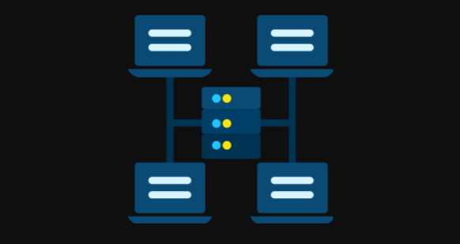
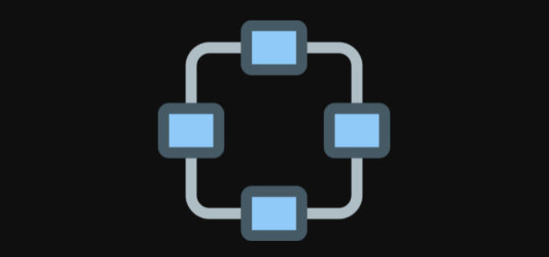
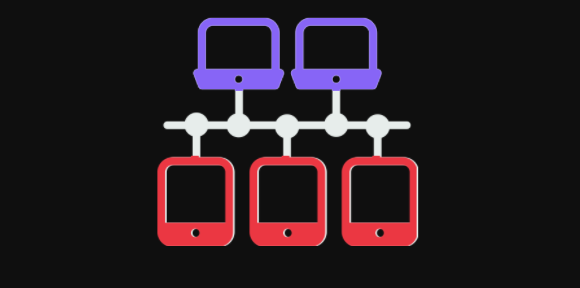
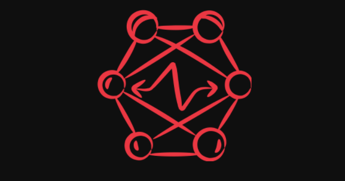
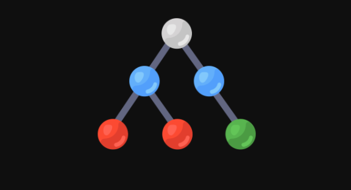
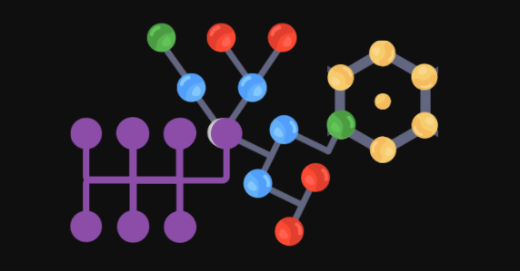

**Network** : A network is a set of devices that are connected with a physical media link. In 
a network, two or more nodes are connected by a physical link or two or more networks 
are connected by one or more nodes. A network is a collection of devices connected to 
each other to allow the sharing of data.

**Network Topology** : Network topology specifies the layout of a computer network. It 
shows how devices and cables are connected to each other.

---
### **Types of Network Topology** 

**Star** :
1. Star topology is a network topology in which all the nodes are connected 
to a single device known as a central device.
2. Star topology requires more cable compared to other topologies. 
Therefore, it is more robust as a failure in one cable will only disconnect a 
specific computer connected to this cable.
3. If the central device is damaged, then the whole network fails. 
4. Star topology is very easy to install, manage and troubleshoot. It is
commonly used in office and home networks.

---
**Ring** :
1.  Ring topology is a network topology in which nodes are exactly connected to two 
or more nodes and thus, forming a single continuous path for the transmission.
2.  It does not need any central server to control the connectivity among the nodes.
3.  If the single node is damaged, then the whole network fails.
4.  Ring topology is very rarely used as it is expensive, difficult to install and 
manage.
5.  Examples of Ring topology are SONET network, SDH network, etc.

---
**Bus** :
1.  Bus topology is a network topology in which all the nodes are connected to a 
single cable known as a central cable or bus.
2. It acts as a shared communication medium, i.e., if any device wants to send the 
data to other devices, then it will send the data over the bus which in turn sends 
the data to all the attached devices.
3.   Bus topology is useful for a small number of devices.
4.  As if the bus is damaged then the whole network fails.

---
**Mesh** :
1.  Mesh topology is a network topology in which all the nodes are individually 
connected to other nodes.
2.  It does not need any central switch or hub to control the connectivity among the 
nodes.
3.  Mesh topology is categorized into two parts: Fully connected mesh topology: 
In this topology, all the nodes are connected to each other. Partially connected 
mesh topology: In this topology, all the nodes are not connected to each other.
4.  It is robust as a failure in one cable will only disconnect the specified computer 
connected to this cable.
5.  Mesh topology is rarely used as installation and configuration are difficult when 
connectivity gets more.
6.  Cabling cost is high as it requires bulk wiring.

 
---
**Tree** :
1.  Tree topology is a combination of star and bus topology. It is also known as the 
expanded star topology.
2.  In tree topology, all the star networks are connected to a single bus.
3.  Ethernet protocol is used in this topology.
4. In this, the whole network is divided into segments known as star networks which 
can be easily maintained. If one segment is damaged, there is no effect on other 
segments.
5.  Tree topology depends on the "main bus," and if it breaks, then the whole 
network gets damaged

---
**Hybrid** :
1.  A hybrid topology is a combination of different topologies to form a resulting 
topology.
2.  If star topology is connected with another star topology, then it remains a star 
topology. If star topology is connected with different topology, then it becomes a 
Hybrid topology.
